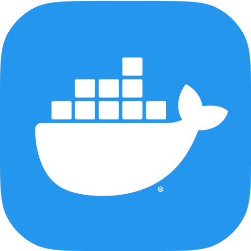
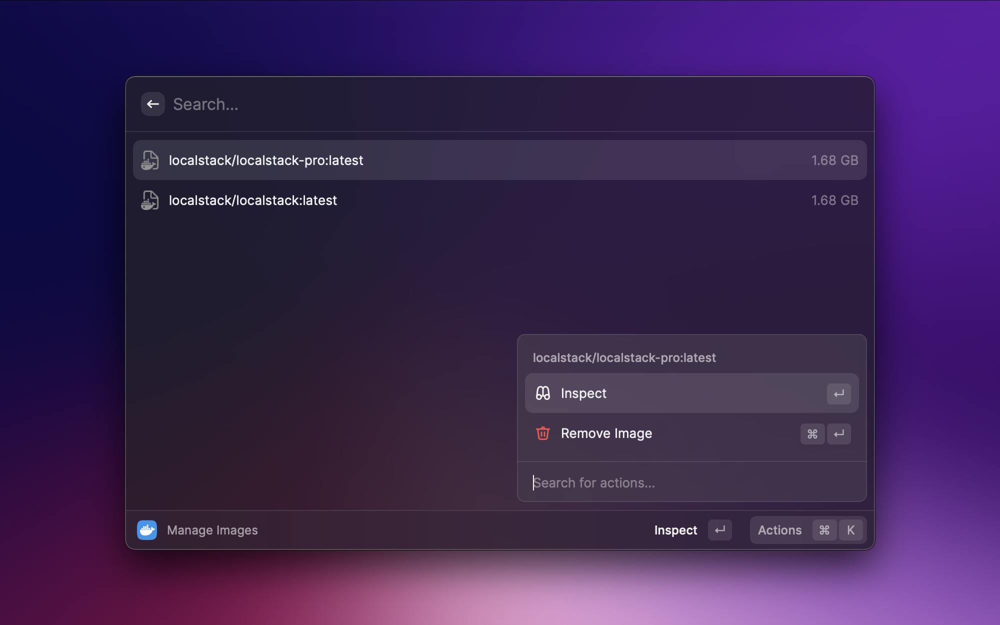
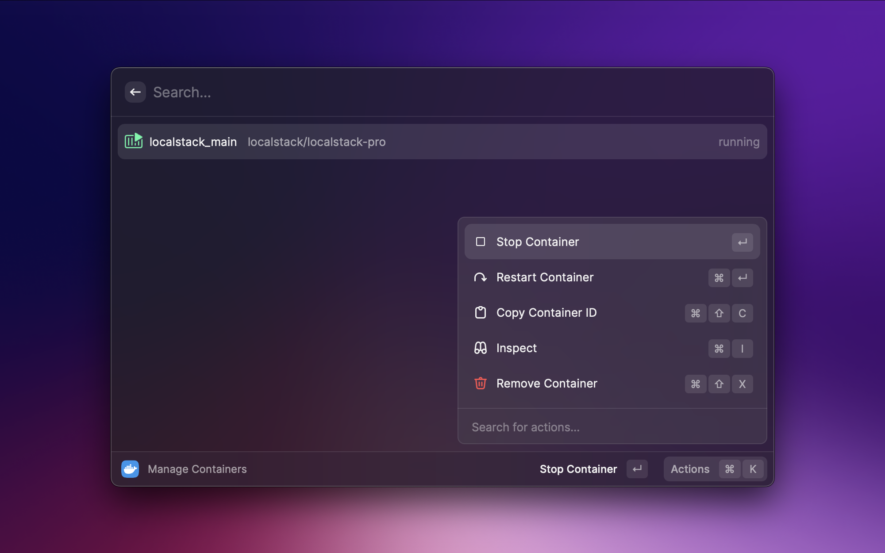
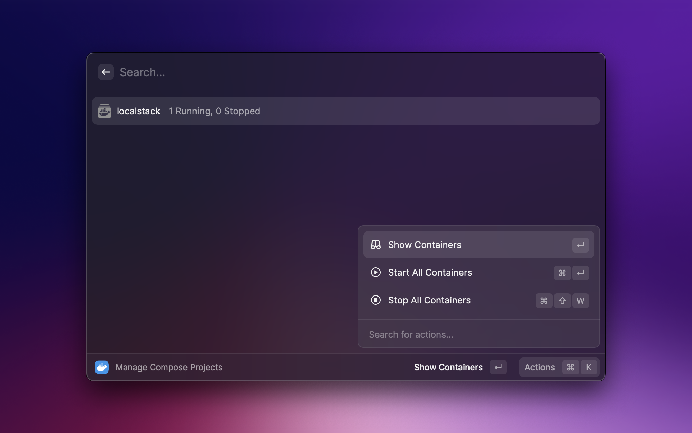

<div align="center">



# Raycast · Docker

**Gestiona contenedores, imágenes y proyectos de Docker Compose desde Raycast.**

Copia local, auditada y versionada de la extensión oficial de Docker para Raycast.

<br />


</div>

---

## 📖 ¿Qué es este repositorio?

Este repositorio contiene la extensión **Docker** para [Raycast](https://www.raycast.com/), importada
desde el monorepo oficial [`raycast/extensions`](https://github.com/raycast/extensions) en un commit
concreto y **revisada línea a línea antes de importarla**.

La idea es sencilla: en lugar de instalar la extensión directamente desde la Raycast Store, tener el
código bajo control propio, saber exactamente qué se ejecuta en la máquina y decidir cuándo (y si)
se actualiza.

| | |
|---|---|
| **Origen** | [`raycast/extensions/extensions/docker`](https://github.com/raycast/extensions/tree/29c078c4a74d44d4ea11fc1704ca143254663775/extensions/docker) |
| **Commit** | `29c078c4a74d44d4ea11fc1704ca143254663775` |
| **Autor original** | [priithaamer](https://github.com/priithaamer) y colaboradores |
| **Licencia** | MIT |

---

## 📸 Capturas

<p align="center">
  
  
  
</p>

---

## ✨ Funcionalidades

###  Manage Containers

Lista todos los contenedores (en ejecución y parados), refrescándose cada segundo.

- ▶️ Arrancar, ⏹️ parar y 🔄 reiniciar contenedores
- 🗑️ Eliminar contenedores (o parar y eliminar en un solo paso)
- 🔍 Inspeccionar: imagen, estado, comando, puertos expuestos, puertos del host y variables de entorno
- 📋 Copiar el ID del contenedor
- 🗂️ Opción para agrupar los contenedores por estado

###  Manage Compose Projects

Agrupa los contenedores por proyecto de Docker Compose.

- Muestra cuántos contenedores hay en marcha y cuántos parados
- ▶️ Arrancar o ⏹️ parar **todos** los contenedores de un proyecto
- Navegar a los contenedores de cada proyecto

###  Manage Images

Lista las imágenes instaladas con su tamaño.

- 🔍 Inspeccionar: ID, tamaño, SO, arquitectura, comando, entrypoint y variables de entorno
- 🗑️ Eliminar imágenes
- ➕ Crear y arrancar un contenedor a partir de una imagen (puertos, nombre, volúmenes y variables de entorno)

### ⌨️ Atajos de teclado

| Acción | macOS | Windows |
|---|---|---|
| Arrancar contenedor / proyecto | <kbd>⌘</kbd> <kbd>⇧</kbd> <kbd>R</kbd> | <kbd>Ctrl</kbd> <kbd>Shift</kbd> <kbd>R</kbd> |
| Parar contenedor / proyecto | <kbd>⌘</kbd> <kbd>⇧</kbd> <kbd>W</kbd> | <kbd>Ctrl</kbd> <kbd>Shift</kbd> <kbd>W</kbd> |
| Reiniciar contenedor | <kbd>⌥</kbd> <kbd>R</kbd> | <kbd>Alt</kbd> <kbd>R</kbd> |
| Inspeccionar | <kbd>⌘</kbd> <kbd>I</kbd> | <kbd>Ctrl</kbd> <kbd>I</kbd> |
| Copiar ID / Crear contenedor | <kbd>⌘</kbd> <kbd>⇧</kbd> <kbd>C</kbd> | <kbd>Ctrl</kbd> <kbd>Shift</kbd> <kbd>C</kbd> |
| Eliminar | <kbd>⌃</kbd> <kbd>X</kbd> | <kbd>Ctrl</kbd> <kbd>D</kbd> |

---

## 🔌 Conexión con Docker

La extensión decide a qué daemon de Docker conectarse en este orden:

1. 🛠️ La preferencia **Socket path** de la extensión (`/var/run/docker.sock`, `unix://…`, `tcp://host:2375`…)
2. 🌍 La variable de entorno `DOCKER_HOST` (junto con `DOCKER_CERT_PATH` y `DOCKER_TLS_VERIFY`)
3. 🧭 El contexto activo de Docker CLI (`~/.docker/config.json` → `~/.docker/contexts/`), incluidos sus certificados TLS
4. 🧱 El socket por defecto de la plataforma

> [!NOTE]
> Los contextos `ssh://` no están soportados: la librería que usa la extensión no incluye transporte SSH.
> En ese caso se usa el socket por defecto.

---

## 🚀 Instalación

**Requisitos:** [Raycast](https://www.raycast.com/), [Node.js](https://nodejs.org/) y Docker
(Docker Desktop, OrbStack, Colima…).

```bash
git clone https://github.com/Serginho/raycast-docker.git
cd raycast-docker

npm ci        # instala exactamente las versiones auditadas del lockfile
npm run dev   # compila e importa la extensión en Raycast
```

> [!TIP]
> Usa siempre `npm ci` en lugar de `npm install`: respeta el `package-lock.json` revisado y no
> resuelve versiones nuevas de las dependencias.

### Scripts disponibles

| Script | Descripción |
|---|---|
| `npm run dev` | Modo desarrollo: importa la extensión en Raycast con recarga en caliente |
| `npm run build` | Compila la extensión en `dist/` |
| `npm run lint` | Pasa ESLint y Prettier |
| `npm run fix-lint` | Corrige automáticamente los problemas de lint |

---

## 🛡️ Auditoría de seguridad

<sub>Revisión realizada el 2026-10-04 sobre el commit `29c078c`.</sub>

| Área | Resultado | Detalle |
|---|:---:|---|
| **Código fuente** (`src/`) | ✅ | Solo habla con el daemon de Docker. Sin `eval`, sin `child_process`, sin peticiones a terceros ni telemetría. Únicamente lee `~/.docker/` para resolver el contexto. |
| **Lockfile** | ✅ | 256 paquetes, todos de `registry.npmjs.org` con hash de integridad. Ninguna versión afectada por los ataques de *supply chain* de npm de 2025 (`chalk`, `debug`, `ansi-*`…). |
| **Install scripts** | ✅ | Solo `esbuild` (oficial, necesario para compilar). |
| **Forks de npm** | ✅ | `@priithaamer/dockerode` y `@priithaamer/docker-modem` comparados archivo a archivo con `dockerode@3.3.1` y `docker-modem@3.0.3`: solo cambian el nombre, eliminan el transporte SSH (`ssh2`) y añaden tipos `.d.ts`. |
| **Assets** | ✅ | PNG válidos, sin datos ocultos tras el bloque `IEND`. |

**Observaciones (no son riesgos):**

- `node-fetch` aparece como dependencia pero el código no la usa.
- Si apuntas la extensión a un daemon remoto por `tcp://` o `http://`, la conexión va sin cifrar (igual que con el CLI de Docker).

---

## 🗂️ Estructura

```text
.
├── assets/              # Iconos de la extensión
├── metadata/            # Capturas para la Raycast Store
├── src/
│   ├── docker/          # Cliente Docker, resolución de host/contexto y helpers
│   ├── ui/              # Toasts
│   ├── utils/           # Utilidades (markdown, groupBy)
│   ├── container_list.tsx    # Comando: Manage Containers
│   ├── projects_list.tsx     # Comando: Manage Compose Projects
│   ├── image_list.tsx        # Comando: Manage Images
│   └── ...                   # Vistas de detalle y formulario de creación
├── package.json         # Manifiesto de la extensión Raycast
└── package-lock.json    # Dependencias auditadas
```

---

## 🔄 Actualizar desde upstream

Para traer una versión nueva, repite el proceso: descarga `extensions/docker` en el commit deseado,
revisa el *diff* (código, lockfile y dependencias nuevas) y haz commit indicando el nuevo hash de origen.

```bash
git clone --filter=blob:none --no-checkout https://github.com/raycast/extensions.git /tmp/rx
cd /tmp/rx && git sparse-checkout set --no-cone extensions/docker && git checkout <commit>
diff -r /tmp/rx/extensions/docker /ruta/a/raycast-docker --exclude=.git --exclude=node_modules
```

---

<div align="center">
<sub>Extensión original © priithaamer y colaboradores · Licencia MIT</sub>
</div>
